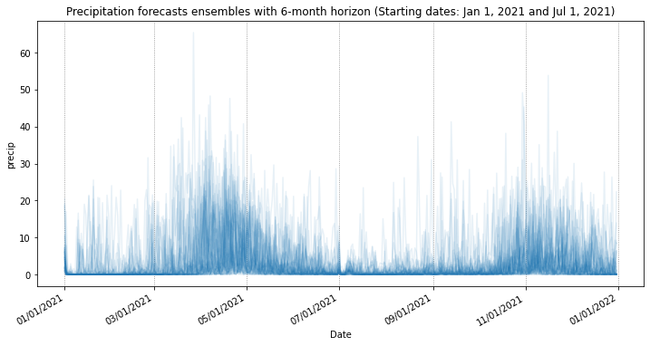
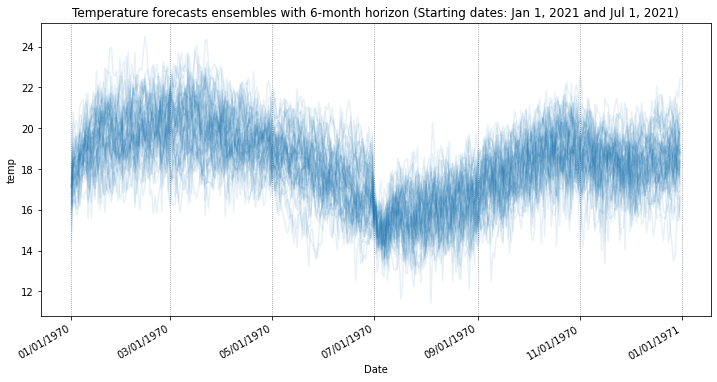
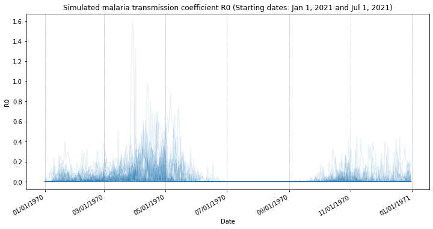

# Surrogate ensemble modeling for dynamic climate impact models

This repository accompanies our paper submitted to NeurIPS 2022 Datasets and Benchmarks track. 

**Abstract:** 

**Contact:** Julian Kuehnert [(julian [dot] kuehnert [at] ibm [dot] com)](mailto:julian.kuehnert@ibm.com)

## Overview:

* ``datasets/``: Files containing seasonal weather forecasts for precipitation and temperature.
* ``figures/``: Folder in which figures from results visualization are saved.
* ``models/``: Python scripts containing the R0 malaria model as well as the ML surrogate models (BLSTM and RFQR).
* ``trained_models/``: Folder in which trained ML models are saved.
* ``utils/``: Python scripts for evaluation and visualization of results.

## Content

### Dataset
Seasonal weather forecasts of precipitation and temperature for coordinate in Nairobi, Kenya:

### Models
Modeled malaria transmission coefficient R0, simulated using the climate-driven R0 model:

## License: 
This work is made available under [Attribution 4.0 International (CC BY 4.0)](https://creativecommons.org/licenses/by/4.0/legalcode) license. ![CC BY 4.0][cc-by-shield]

## Citation
